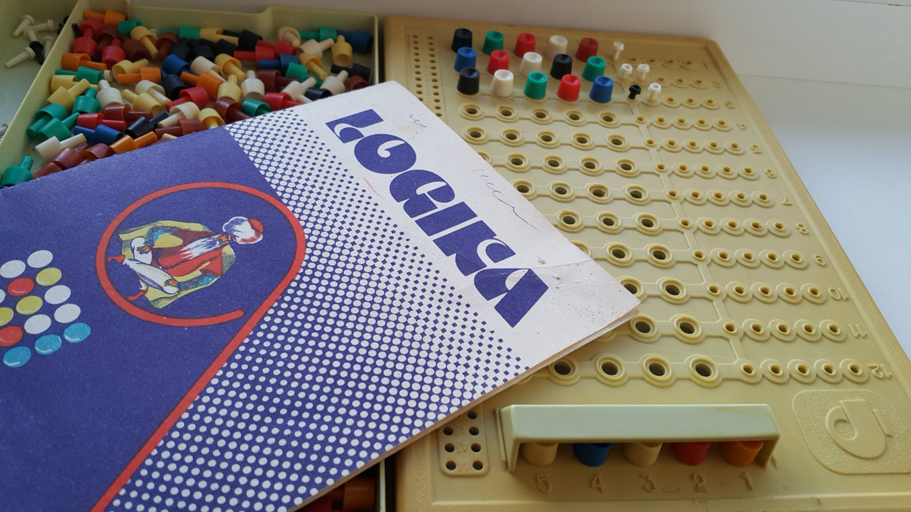

# Logika / Mastermind game

[Play now / See it in action](https://keks.ee/logika/)

An old Soviet board-game Logika (similar to international [Mastermind](https://en.wikipedia.org/wiki/Mastermind_(board_game))).

Rules:
* Computer composes a secret color combination
* Player tries to guess it, row by row
* Computer responds with black and white pins
  * Black: some guessed color is at the correct position
  * White: some guessed color exists, but at different position
* Repeat until you know the correct secret (5 blacks)!

Implemented in [Svelte](https://svelte.dev/).

Works on Desktop, Mobile devices (installable as an app) and even Tesla.

Web technologies rule for portability!
